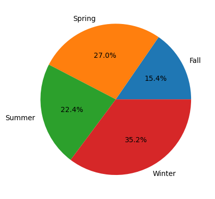
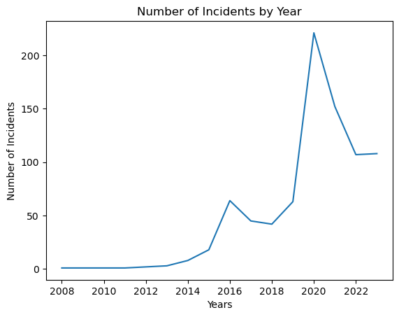
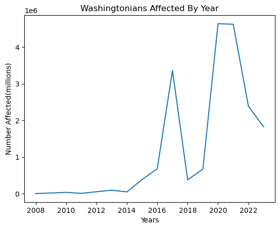
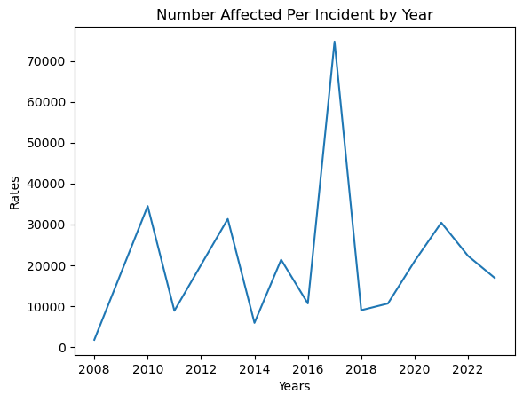

# WA_Databreaches_Predictive_Analysis

  

## Introduction
The "Data Breach Notifications Affecting Washington Residents" database is a record kept by Washington State officials with various categories of information, including the names of organizations. Which is of note here because not all of the organizations are based in Washington State.

Cybersecurity is a very pertinent subject in todays market and society, and the exploration of data and statistics involving cybersecurity is necessary for all people and organizations including private, military, government, and individual. Awareness itself is a key factor in reducing breaches.

### Purpose
The purpose of this analysis is to provide awareness to the public and relevant organizations via predictive modeling and hypothesis testing. The goal of which is to reach valid conclusions with reasonable confidence. I also hope as a byproduct to provide examples with which this database and others could be improved in order to support predictive modeling, statistical exploration, and hypothesis testing. Outside of that I think it's quite important to encourage the development and use of databases like this by Cybersecurity professionals in relevant positions.

### Database: Initial Exploratory Data Analysis

#### Database Information
---
The database contains information on 990 databreaches(990 rows). There are 24 descriptive columns:

1. DateAware - date org became aware of breach
2. DateSubmitted - date org submitted information
3. DataBreachCause* - Cause of databreach
4. DateStart* - date attack started
5. DateEnd - date attack ended
6. Name - name of org
7. Id - form id
8. CyberattackType* - type of cyber attack
9. WashingtoniansAffected* - number affected
10. IndustryType* - type of organization
11. BusinessType* - subtype of business industry
12. Year - fiscal year, when form was submitted
13. YearText - redundant(Year)
14. WashingtoniansAffectedRange - categorical ranges
15. BreachLifecycleRange - categorical ranges
16. DaysToContainBreach - derivative(days to end exposure)
17. DaysToIdentifyBreach - derivative(days from start to aware)
18. DaysBreachLifecycle - derivative(TimetoIdentify + TimetoContain)
19. DiscoveredInProgress - Whether or not DateAware is between start and end
20. DaysOfExposure - rendundant(DaysToContainBreach)
21. DaysElapsedBetweenEndAndDiscovery - derivative(DateAware - DateEnd)
22. EndedOnDayDiscovered - Whether or not DateAware is same as DateEnd
23. DaysElapsedBeforeNotification - Days between DateAware and DateSubmitted
24. DaysOfExposureRange - categorical ranges

\* columns are columns that have been used in my analysis others have been dropped and/or unutilized for various reasons.

Now, as you can see, many of the columns are derivative and due to the nature of the data are unreliable and/or useless in predictive modeling, hypothesis testing, or in gleaning most general conclusive information. For instance: Ended on Day discovered does no indicate if the organization put a stop to the breach, though it may have been intended to.

That being said some columns may or may not be useful in other cases but were not useful in my analysis.

---

I have added my own columns and completed some transformations on the data in order to make it more palatable: ActualYears and Season.

ActualYears uses the year from DateStart so as to accurately group the data by the year the attack actually occurred rather than the fiscal year in which it was reported.

Seasons uses the month from DateStart to calculate the season in which the attack occured.

Additionally I transformed the date columns to dt.datetime objects to enable efficient manipulation and I have changed all instances of DataBreachCause = Cyberattack & CyberattackType = NaN to 'Unreported' to reflect the reality of the situation as well as make the data usable.

#### Database Discoveries
---

  

Due to the additon of the seasons column I have been able to infer that Winter is a season of increased activity. With some outside research the phenomenon is easily explained: “The Federal Bureau of Investigation (FBI) and the Cybersecurity and Infrastructure Security Agency (CISA) have observed an increase in highly impactful ransomware attacks occurring on holidays and weekends.”
(cisa.gov)

---

With the addition of the ActualYears column I have also been succesful in deriving further useful information: the basis of my predictive model.

  

  

We can see here a general upwards trend in both the number of incidents and the number of people affected each year. Also observe the relationship between the two. Sensibly enough, as the number of incidents goes up, so does the number of people affected, and visa versa.

---

  

By dividing the number affected per year, by the number of incidents per year we get a rate: Number of people affected per incident per year.
Observe the biannual fluctuations of the rate.

 ”According to the Online Trust Alliance (OTA), the number of cybersecurity incidents nearly doubled from the previous year. Attributed…  to the unprecedented rise of ransomware” (securityintelligence.com, Larry Loeb, 2018)

This is speaking to the spike 2017 where the rate for just Washington far more than doubled. This also goes to show that cyber attack and cyber defense have a back-and-forth relationship, very much like a competition, where each side comes up with new technology and methods on an (essentially) yearly basis.

I think the occasional spike is to be expected, because data at this point is generally secure by nature, and becomes more available to attackers with the occasional increase in scalability or capability.

Unlike the obove plots, the rate does not really show the same general upward trend, meaning that attackers are generally getting the same biannual bang for their buck in their fight against cybersecurity.

## Predictive Modeling
As stated the goal was to create a predictive model that could theoretically be fielded for use in assisting to increase awareness, provide information, and/or prevent future attacks. The information provided by the database is sparse, far too categorical and derivative to get down to the nitty gritty of predicting attacks.

I think that including information on the presence or absence of attack prevention methods, the presence or absence of capable personnel, and/or information covering the type of data that was targeted and the size of the organization and their database would be far more indicative of the chances of being attacked and would be far more informative as to the number of people who would be affected.

The model I have provided is intended to provide a end of year summary, where that data may not be available for a substantial amount of time. I do this by creating a linear regression using the number of incidents to predict the number of people affected. Which can provide some information where it may not otherwise be available when needed. Given some time and development this model could also be used in predicting numbers for future years, and hopeuflly be joined by other models.

### Model Behavior
The model will take a number of incidents for a given year, and predict the total number of affected people for that year.

### Model Performance

## Hypothesis Testing

### Gov vs. Non-Profit/Charity(individual)

### Gov vs. Non-Profit/Charity(over time)

## Conlusion

### The Future

### For You